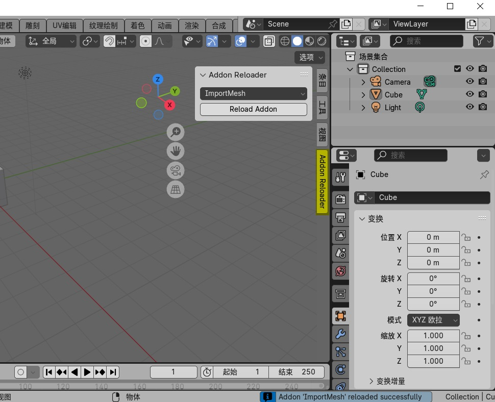

# 插件重载器 Addon Reloader

    快速重新加载插件, 无需进入设置手动禁用在启用
    适合开发调试Blender插件时是用
    Easily reload addons without restarting Blender

    代码由claude-3-5-sonnet生成

## 使用方法

    安装插件, 进入插件设置, 启用插件, 
    然后即可在3D视图中找到 AddonReloader 按钮
    选择你正在调试的插件,点击按钮即可重新加载插件

