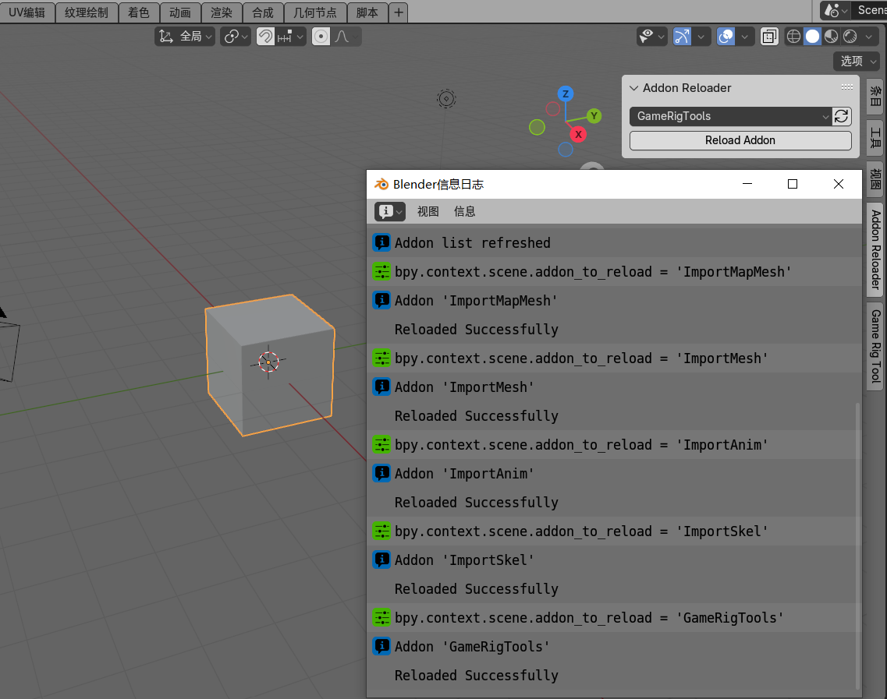
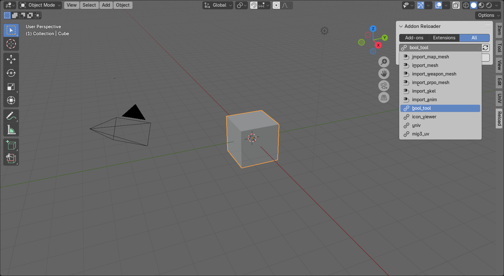

# 插件重载器 Addon Reloader

## English

## Note
Addon Reloader was initiated by letleon and developed with the assistance of Kimi and Claude.

## Overview
Addon Reloader is a Blender add-on that allows users to Fast reload user add-ons or extensions without restarting Blender. This is particularly useful for developers who frequently make changes to their add-ons and need to see the changes in action immediately.

## Features
- Fast reload user add-ons or extensions.
- No need to restart Blender to see changes.
- Supports both add-ons and Blender extensions.

## Compatibility
This add-on is compatible with Blender 4.2 and later versions.

## Usage
After installation, you can access Addon Reloader in the View3D window's sidebar under the "Reload" category. Here's how to use it:

1. Switch to the View3D workspace.
2. Open the sidebar panel by clicking on "Reload".
3. Select the add-on or extension you want to reload from the list.
4. Click the "Reload" button to reload the selected add-on or extension.

## 中文

## Note
Addon Reloader 由 letleon 发起，在Kimi和Claude的辅助下完成开发。

## 概述
Addon Reloader 是一个 Blender 插件，允许用户快速重新加载用户插件或扩展，无需重启 Blender。这对于经常需要对插件进行更改并立即查看更改效果的开发者来说非常有用。

## 特性
- 快速重新加载用户插件或扩展。
- 不需要重启 Blender 即可查看更改。
- 支持插件和 Blender 扩展。

## 兼容性
此插件兼容 Blender 4.2 及更高版本。

## 使用方法
安装后，您可以在 View3D 窗口的侧边栏下的“Reload”类别中访问 Addon Reloader。以下是如何使用它：

1. 切换到 View3D 工作区。
2. 点击“Reload”打开侧边栏面板。
3. 从列表中选择要重新加载的插件或扩展。
4. 点击“Reload”按钮重新加载所选的插件或扩展。

