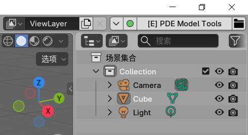

# Addon Reloader

## English

Fast reload Blender add-ons and extensions without restarting. Designed for developers who iterate frequently.

### Features
- One-click reload of add-ons / extensions
- Enable / disable toggle
- Quick open addon folder
- Remembers last selected addon across sessions

### Compatibility
Blender 4.2 LTS and later (up to 5.1+).

### Usage
Install via Blender → Preferences → Extensions. The toolbar appears in the top-right of the top bar.

---

## 中文

无需重启 Blender，一键快速重载插件或扩展。专为频繁迭代的开发者设计。

### 特性
- 一键重载插件 / 扩展
- 启用 / 禁用切换
- 快速打开插件目录
- 记住上次选择的插件或扩展

### 兼容性
Blender 4.2 LTS 及以上版本（至 5.1+）。

### 使用方法
通过 Blender → 偏好设置 → 扩展 安装。工具栏显示在顶部栏右上角。

## License

GPL-3.0-or-later · © 2024 [letleon](https://github.com/0xletleon/AddonReloader)
