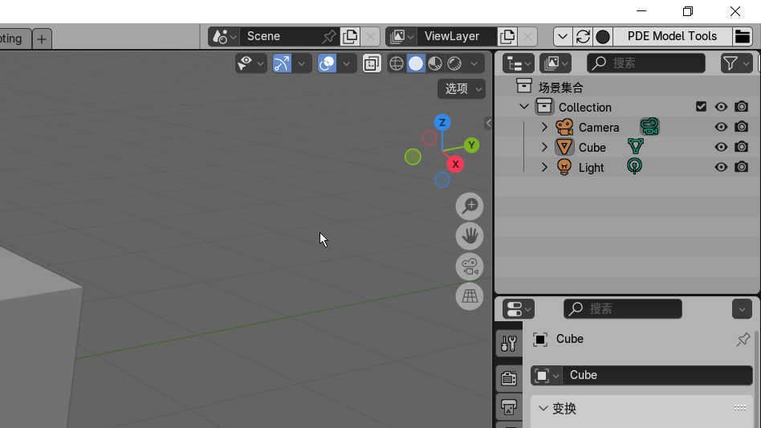

# Addon Reloader - Blender插件重载工具

https://github.com/user-attachments/assets/b567e151-fc97-4f8d-8baa-28e1b026ad8b

## English

## Overview
Addon Reloader is a Blender add-on that allows users to Fast reload user add-ons or extensions without restarting Blender. This is particularly useful for developers who frequently make changes to their add-ons and need to see the changes in action immediately.

## Features
- Fast reload user add-ons or extensions.
- No need to restart Blender to see changes.
- Supports both add-ons and Blender extensions.

## Compatibility
This add-on is compatible with Blender 4.2 and later versions.

## Usage
After installation, you can find the “Reload” button in the top right corner of the Blender top bar.

## 中文

## 概述
Addon Reloader 是一个 Blender 插件，允许用户快速重新加载用户插件或扩展，无需重启 Blender。这对于经常需要对插件进行更改并立即查看更改效果的开发者来说非常有用。

## 特性
- 快速重新加载用户插件或扩展。
- 不需要重启 Blender 即可查看更改。
- 支持插件和 Blender 扩展。

## 兼容性
此插件兼容 Blender 4.2 及更高版本。

## 使用方法
安装后，您可以在 Blender 顶部栏右上角找到 “Reload”” 按钮。
